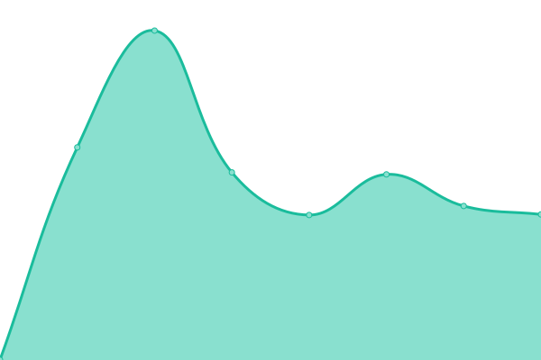

# [📈 Live Status](https://ajaxsys.github.io/upptime): <!--live status--> **🟧 Partial outage**

This repository contains the open-source uptime monitor and status page for [Andy Fang](https://ajaxsys.github.io/upptime), powered by [Upptime](https://github.com/upptime/upptime).

With [Upptime](https://upptime.js.org), you can get your own unlimited and free uptime monitor and status page, powered entirely by a GitHub repository. We use [Issues](https://github.com/ajaxsys/upptime/issues) as incident reports, [Actions](https://github.com/ajaxsys/upptime/actions) as uptime monitors, and [Pages](https://ajaxsys.github.io/upptime) for the status page.

<!--start: status pages-->
<!-- This summary is generated by Upptime (https://github.com/upptime/upptime) -->
<!-- Do not edit this manually, your changes will be overwritten -->
<!-- prettier-ignore -->
| URL | Status | History | Response Time | Uptime |
| --- | ------ | ------- | ------------- | ------ |
|  [T7](https://www.trip7.co.jp/api/hotel_company/get/1) | 🟩 Up | [t7.yml](https://github.com/ajaxsys/upptime/commits/HEAD/history/t7.yml) | 

 809ms
     
 | 

<a href="https://ajaxsys.github.io/upptime/history/t7">100.00%</a>
    

|  [CNPK](https://www.conepoke.com/api/Commodity/count/all) | 🟥 Down | [cnpk.yml](https://github.com/ajaxsys/upptime/commits/HEAD/history/cnpk.yml) | 

 0ms
     
 | 

<a href="https://ajaxsys.github.io/upptime/history/cnpk">0.00%</a>
    

|  OT Test | 🟥 Down | [ot-test.yml](https://github.com/ajaxsys/upptime/commits/HEAD/history/ot-test.yml) | 

 700ms
     
 | 

<a href="https://ajaxsys.github.io/upptime/history/ot-test">53.73%</a>
    

|  OT Prod | 🟥 Down | [ot-prod.yml](https://github.com/ajaxsys/upptime/commits/HEAD/history/ot-prod.yml) | 

 678ms
     
 | 

<a href="https://ajaxsys.github.io/upptime/history/ot-prod">53.92%</a>
    

|  OT Su | 🟩 Up | [ot-su.yml](https://github.com/ajaxsys/upptime/commits/HEAD/history/ot-su.yml) | 

 1035ms
     
 | 

<a href="https://ajaxsys.github.io/upptime/history/ot-su">100.00%</a>
    

<!--end: status pages-->

[**Visit our status website →**](https://ajaxsys.github.io/upptime)

## 📄 License

- Powered by: [Upptime](https://github.com/upptime/upptime)
- Code: [MIT](./LICENSE) © [Andy Fang](https://ajaxsys.github.io/upptime)
- Data in the `./history` directory: [Open Database License](https://opendatacommons.org/licenses/odbl/1-0/)
